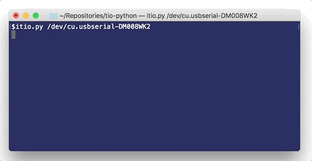

# Python Twinleaf I/O

This package implements a communications protocol in python to work with [Twinleaf sensors](http://www.twinleaf.com) using [Twinleaf I/O (TIO)](https://github.com/twinleaf/libtio/blob/master/doc/TIO%20Protocol%20Overview.md) as the communications layer. Data from the sensors is received via PUB messages and sensor parameters may be changed using REQ/REP messages. 


## Use

Two example scripts are installed with this package:

  - itio: A interactive session for configuring devices
  - tio_monitor: A live graph of streamed data (does not work on windows)

These examples can be called with "url" that is either a serial port (`/dev/cu.usbserialXXXXXX`, `/dev/ttyUSBx`, `COMx`) or a net url such as `tcp://localhost`. 



## Prerequisites

[Python](https://www.python.org/downloads/) >= 3.6 is required.

  - Windows may use the [python.org installer](https://www.python.org/downloads/)
  - macOS may consider installing with [Homebrew](https://brew.sh): `brew install python3`
  - linux use your native package manager; debian/ubuntu: `sudo apt-get install python3`.

The interactive prompt is a lot better if ipython is available (`pip3 install ipython`).

## Installation

`tio-python` is uploaded to [PyPI](https://pypi.org) and can be installed/upgraded using `pip`:

  - Windows Command Prompt `> py -m pip install tio --upgrade`
  - macOS/linux `$pip3 install tio --upgrade`

Windows users who can't run python might need to [add python to their path](https://www.pythoncentral.io/add-python-to-path-python-is-not-recognized-as-an-internal-or-external-command/).

## Performance

Sadly, python is not the best choice for fast data processing. If the background thread ingesting the data does not keep up with the data rate, it exits with an error.

At the moment, the native serial interface is significantly slower than the TCP version. As a result, we recommend that users use the TCP proxy program found in [tio-tools](https://github.com/twinleaf/tio-tools) to manage the serial port in C and convert the data into a TCP stream. The proxy has the added advantage that multiple clients can simultaneously connect to the sensor and use the data. 

Terminal #1: serial proxy

  $ bin/proxy /dev/ttyUSB0

Terminal #2: your python program

  $ itio.py
  ...

where the proxy serves to port 7855 and itio by default connects to that port on localhost. This also permits more interesting networking topologies and distributed signal anslysis possible.

## Programming

The `tldevice` module performs metaprogramming to construct an object that has methods that match the RPC calls available on the device. It uses the `tio` module, a lower-level library for connecting and managing a communication session. To interact with a Twinleaf CSB current supply, a script would look like:

```
import tldevice
csb = tldevice.Device('COM1')
csb.coil.x.current(0.25) # mA
```

To receive data streams from a sensor such as the [Twinleaf VMR vector magnetometer](http://www.twinleaf.com/vector/VMR), it is possible to use the named streams such as vmr.gmr(duration=1) to get one second of data. To get the data from all the streams synchronously, use the iterator at vmr.data.stream_iter(). A simple logging program for the VMR vector magnetometer would look like this:

```
import tldevice
vmr = tldevice.Device()
file = open('log.tsv','w') 
for row in vmr.data.stream_iter():
  rowstring = "\t".join(map(str,row))+"\n"
  file.write(rowstring)
```

## TODO

  - [x] Threaded session management
  - [ ] Attempt automatic reconnection on loss of port
  - [ ] stream_iter smarter should terminate if the setup changes